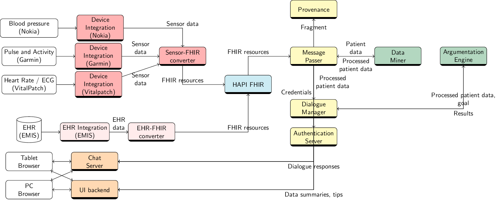

Modular decision-support system for chronic condition self-management.

[Demo](https://kclhi.org/consult/demo/?a=UGU2YmFxRUQ6dWtlN2JQRXk=) | [Docs](https://www.overleaf.com/read/scvyqpzvtycj#31ae61)

Cite as _[Computational Argumentation-based Clinical Decision Support](https://dl.acm.org/doi/10.5555/3306127.3332107). Chapman, Martin et al. Autonomous Agents and Multiagent Systems (AAMAS). 2019._

___

Components of the CONSULT architecture

## Contributing

Please read [CONTRIBUTING.md](withings/CONTRIBUTING.md) for details on our code of conduct, and the process for submitting pull requests to us.

## Versioning

We use [SemVer](http://semver.org/) for versioning. For the versions available, see the [tags on this repository](https://github.com/martinchapman/consult/tags).

## Authors

[kclhi](https://kclhi.org)

## License

This project is licensed under the MIT License - see the [LICENSE.md](withings/LICENSE.md) file for details.

## Acknowledgments

* [HAPI-FHIR](https://github.com/kclconsult/fhir-server)
* [Provenance server](https://github.com/kclconsult/provenance-server)
* [Provenance templates](https://github.com/kclconsult/provenance-templates)
* [Mattermost](https://github.com/kclconsult/mattermost-docker)
* [Clingo](https://github.com/kclconsult/clingo)
* [Libpotassco](https://github.com/kclconsult/libpotassco)
* [ABAplus](https://github.com/kclconsult/ABAplus)
* [openldap](https://github.com/kclconsult/docker-openldap)
* [rabbitmq](https://github.com/kclconsult/rabbitmq)
* [plumber](https://github.com/kclconsult/plumber)
* [neo4j](https://github.com/kclconsult/docker-neo4j)
* [shinyproxy](https://github.com/kclconsult/shinyproxy)

